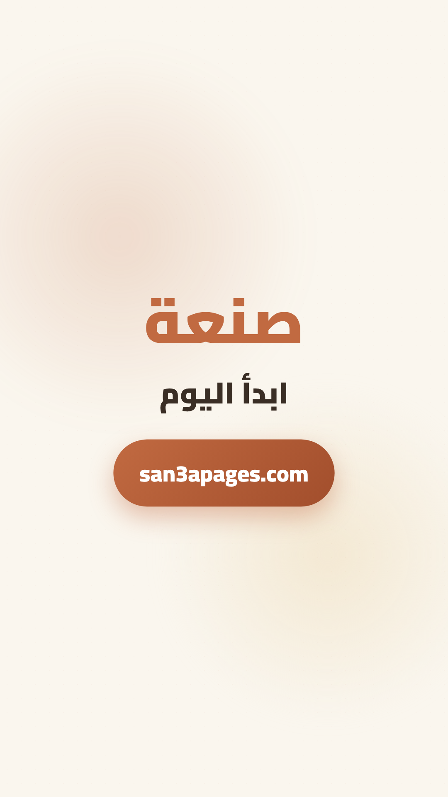

# صنعة — San3a Pages video ad

A short vertical (9:16) video ad for **[San3a Pages](https://san3apages.com)** —
the SaaS that gives Algerian artisans a professional portfolio page on a single
link, with WhatsApp appointment booking, PDF invoices and QR codes
(annual activation key, 4500 DZD/year).

Built with [Remotion](https://remotion.dev). Fully Arabic / RTL, using the Cairo
font and the site's own "Nature Distilled" terracotta‑and‑cream palette.



## What's in it (≈29s, 1080×1920, 30fps)

| # | Scene | Message |
|---|-------|---------|
| 1 | Hook | عندك صنعة؟ أعطيها حضور رقمي في دقائق |
| 2 | Brand | صنعة · San3a Pages — صفحتك الاحترافية برابط واحد |
| 3 | Portfolio link | رابط واحد يجمع كل أعمالك — `san3apages.com/اسمك` (phone mockup) |
| 4 | WhatsApp booking | حجز المواعيد عبر واتساب |
| 5 | PDF invoices | فواتير PDF احترافية |
| 6 | QR code | رمز QR لمشاركة سهلة |
| 7 | Pricing | 4500 دج في السنة — مفتاح تفعيل تشريه كاش |
| 8 | CTA | ابدأ اليوم — san3apages.com |

## Run it

```bash
npm install
npm run dev      # open Remotion Studio to preview/edit
npm run render   # render to out/san3a-ad.mp4
```

The rendered ad is committed at [`out/san3a-ad.mp4`](out/san3a-ad.mp4).

### Rendering notes for this sandbox

This project was rendered inside a restricted environment. Two flags were needed
that you typically **don't** need on a normal machine:

- `--browser-executable=...` — point Remotion at a Chrome Headless Shell binary
  (the default download host was not in the network allowlist; one was fetched
  via `npx puppeteer browsers install chrome-headless-shell`).
- `--ignore-certificate-errors` — the egress proxy intercepted TLS, so Chrome
  rejected `fonts.gstatic.com` until cert errors were ignored.

On your own machine, plain `npm run render` works without either flag.

## Structure

```
src/
  Root.tsx            registers the <SanaAd> composition (1080×1920, 30fps)
  SanaAd.tsx          the scene timeline (durations + cross‑fades)
  theme.ts            brand palette (hex of the site's oklch tokens)
  fonts.ts            Cairo (Arabic subset)
  components/         Background, Scene wrapper, Rise/IconBadge, PhoneMockup, QrCode
  scenes/             Hook, Brand, 4 feature scenes, Pricing, Cta
```

> Brand colors are derived from `src/app/globals.css` of the
> [san3a repo](https://github.com/aissamzz/san3a) (`--primary: oklch(0.59 0.15 45)`,
> warm cream background, sand/amber accents). The QR graphic is decorative, not a
> scannable code.
